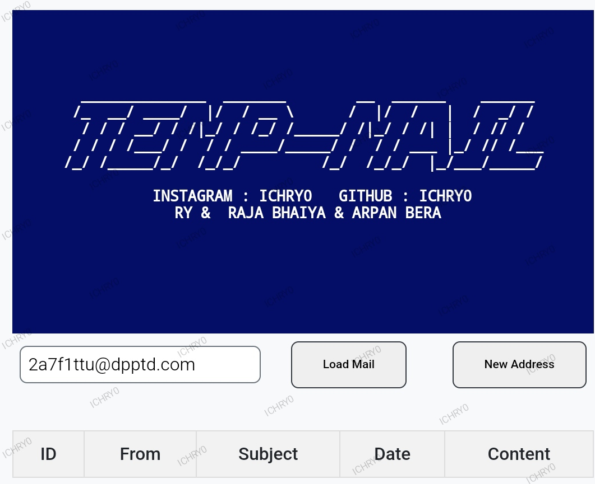

# TEMP-MAIL-ICHRY0
- TempMail is a simple web application that allows you to generate temporary email addresses and view the emails received by these addresses. 

 
⚠️ This project is purely for educational purposes. We do not allow illegal things to be done with this project and we are not responsible for any incidents that may occur. Use it legally ⚠️

(visitor since 6 DECEMBER 2024)
## Live
- [Live Website!](https://ichry0.github.io/TEMP-MAIL-ICHRY0/)
## Features
Generate a new temporary email address

Load emails for the current temporary email address

View email content and download attachments

## Usage
- Open index.html in your web browser.

- Click the "New Address" button to generate a new temporary email address.

- The new email address will be displayed in the input field.

- Click the "Load Mail" button to load emails for the current temporary email address.

- The emails will be displayed in a table below the buttons. You can click "Load content..." to view the content of each email.

## Dependencies
- jQuery: Used for making API requests and manipulating the DOM.

- Font Awesome: Used for icons.

- Water.css: Used for basic styling.
## Author
Created by ICHRY0 : RY

## License
This project is open source and available under the Apache License.

## Important note!
This project uses 1secmail API for creating e-mails

##  Todo
[] add delete permanently mail
[] add saved e-mails list
[] clear inbox button

